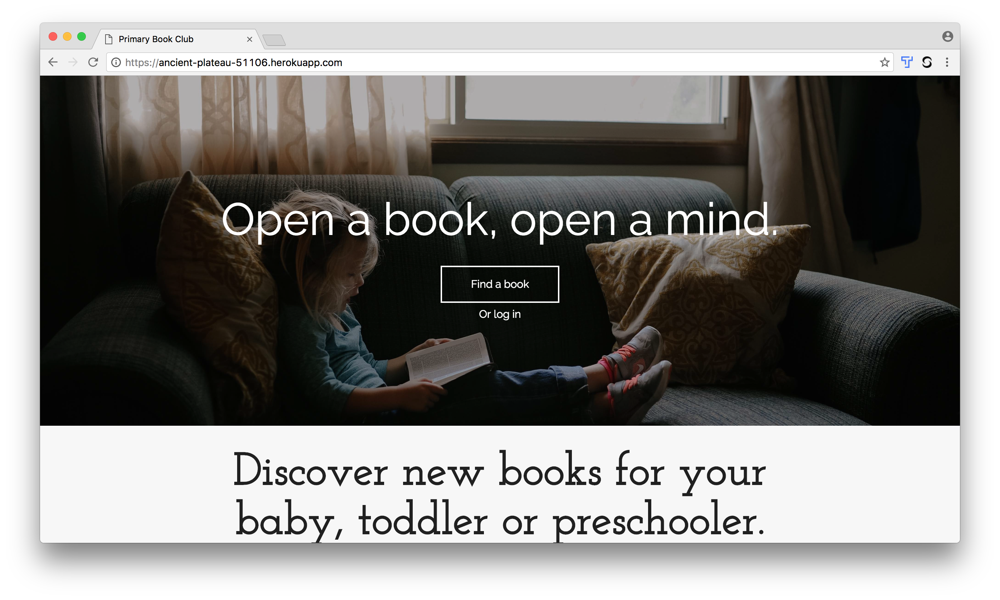
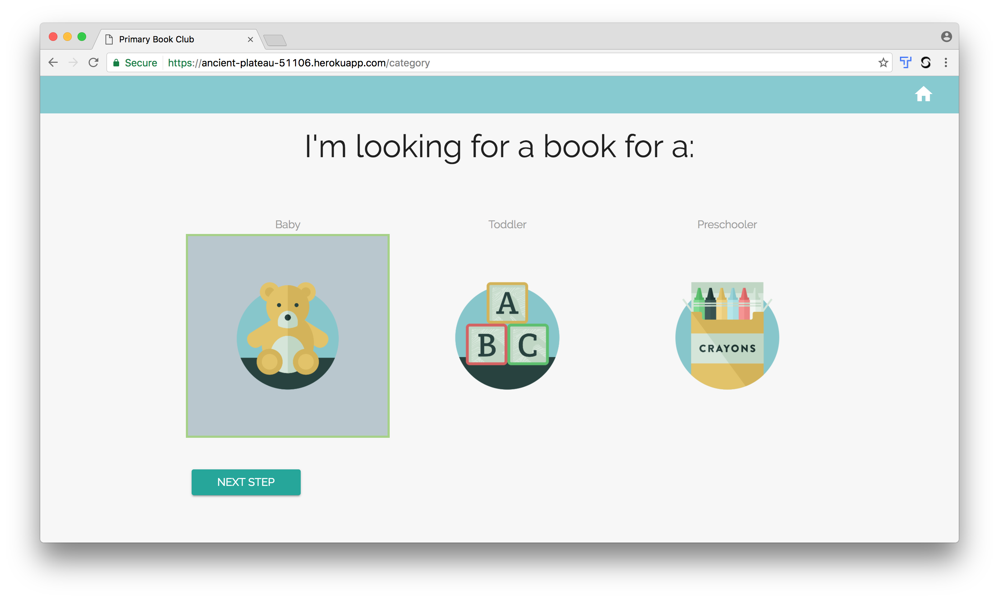
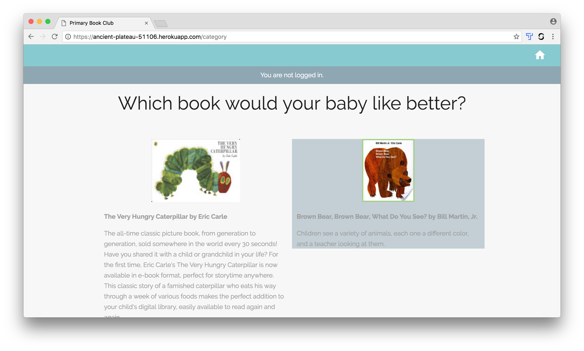
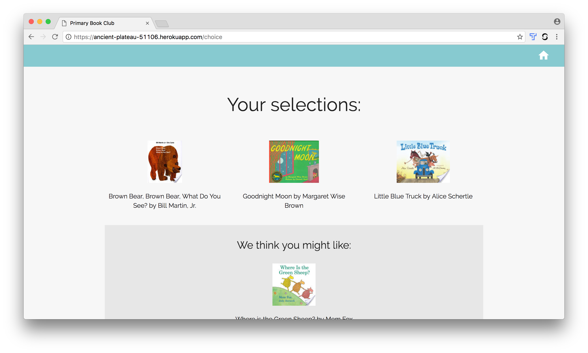
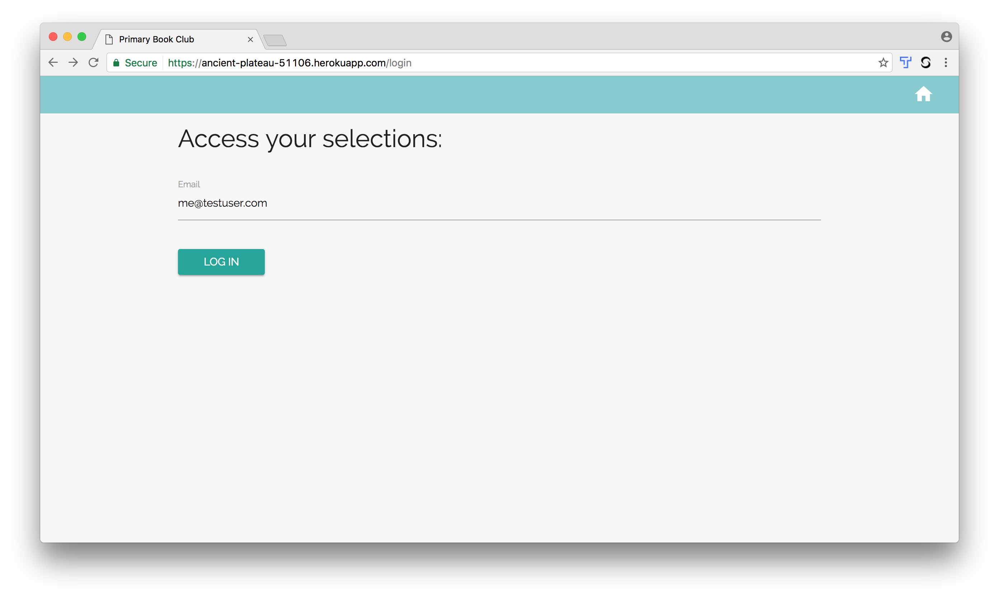

# Primary Book Club

[](https://travis-ci.org/ewitmer/book_suggestion) [](https://david-dm.org/ewitmer/book_suggestion.svg)


The goal of this application is to help parents of young children discover new books to read together. A live version of the site can be found [here](https://ancient-plateau-51106.herokuapp.com).



Parents are first asked to select the age range of the child.



Parents are then guided through a series of choices and asked to select the book they feel their child would prefer between a pair of well known books. 



Based on their selections, a simple algorithm (binomial option tree) is used to recommend a lesser known book they might like. 



The parent can save the selections and recommendation, and then log in to retrieve the information, make changes to their preferences and receive a new recommendation, or delete their account.




## Getting Started

These instructions will guide you through getting a copy of the project up and running on your local machine for development and testing purposes. 

### Prerequisites

Before you begin, you will need to have the following installed on your local machine:

* Git - [Download & Install Git](https://git-scm.com/downloads). 
* Node.js - [Download & Install Node.js](https://nodejs.org/en/download/) and the npm package manager. 
* MongoDB - [Download & Install MongoDB](http://www.mongodb.org/downloads), and make sure it's running on the default port (27017).

### Development

Clone the github repo

```
$ git clone https://github.com/ewitmer/book_suggestion.git
```

Navigate into main directory 

```
$ cd book_suggestion
```

Install dependencies

```
$ npm install
```

Set up a development database with [MongoDB](http://mongodb.github.io/node-mongodb-native/2.2/quick-start/)

Update the database variable in the application

```
$ open app/app.js
```
```
22  // update with development database connection parameters
23  mongoose.connect(process.env.DATABASE_URL)
```

Run the application

```
$ npm start
```

Navigate to: [http://localhost:3000](http://localhost:3000) and start running through the application to add some test data.

## Running the tests

To run the tests:

```
$ npm test
```

The tests are broken down into three modules:

* test-decision.js: runs tests on the decision model, which builds and runs the recommendation algorithm
* test-routes.js: runs tests on the router 
* test-user.js: runs tests on the tempUser and user models

## Deployment

Deploying a live version will require a database as a service such as [mLab](https://mlab.com/) and platform as a service such [Heroku](https://www.heroku.com).

## Built With

* [NodeJS](https://nodejs.org/en/docs/)
* [Express](http://expressjs.com/en/4x/api.html)
* [MongoDB](http://mongodb.github.io/node-mongodb-native/2.2/api/)
* [EJS](http://www.embeddedjs.com/)
* [Materialize](http://materializecss.com/)


## Authors

* **Erin Witmer** -- Find me on [LinkedIn](https://www.linkedin.com/in/erinwitmer)


## Acknowledgments

* This was Capstone project #2 of 4 through the [Thinkful](https://www.thinkful.com/bootcamp/web-development/flexible/) flexible web development bootcamp
* The inspiration was my own experience and work on my startup [Primary Book Club](https://www.primarybookclub.com)
* Many thanks to Thinkful and my mentor in the program [Mohamed Osman](https://github.com/ameno-)!